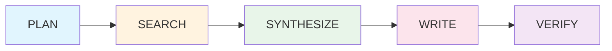
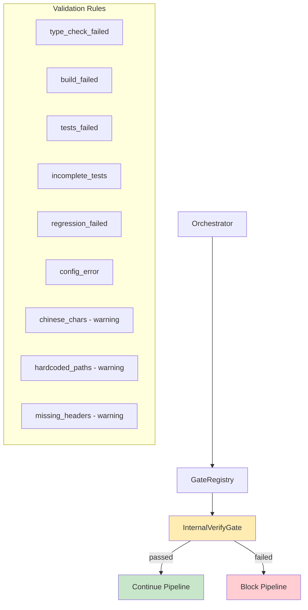
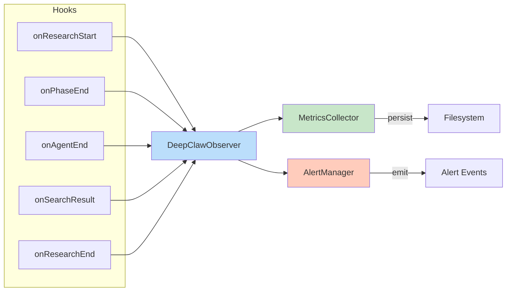
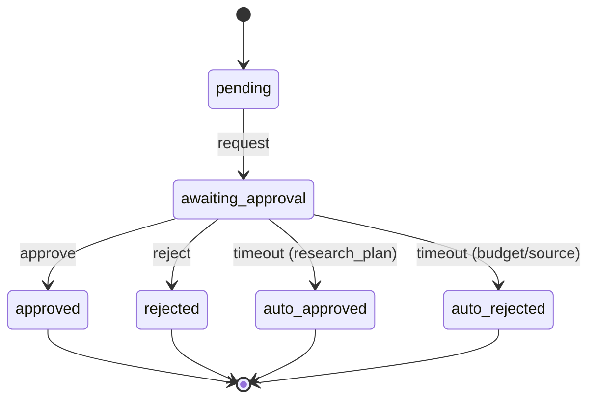
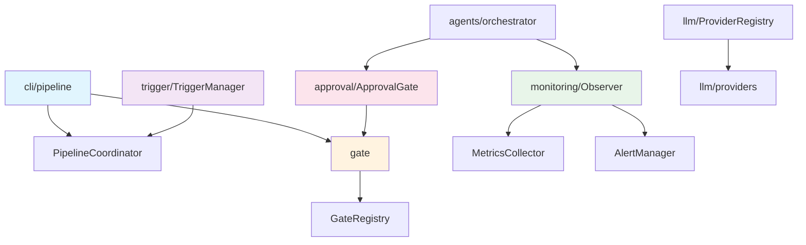
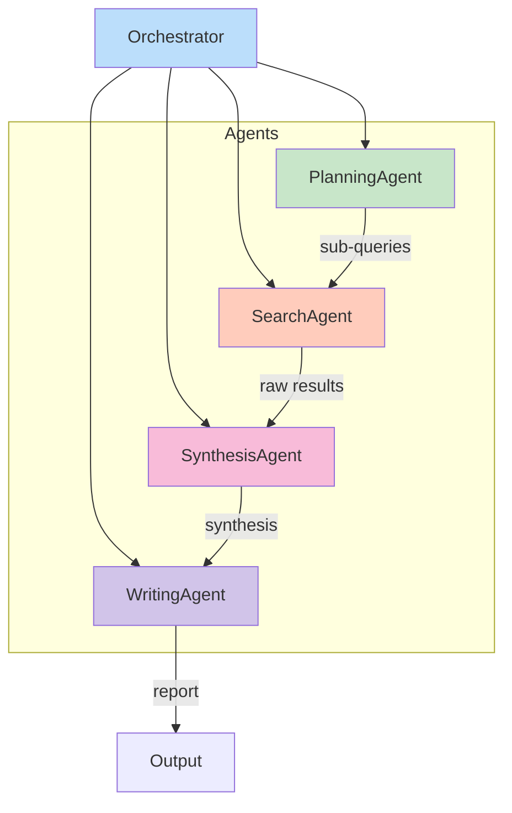
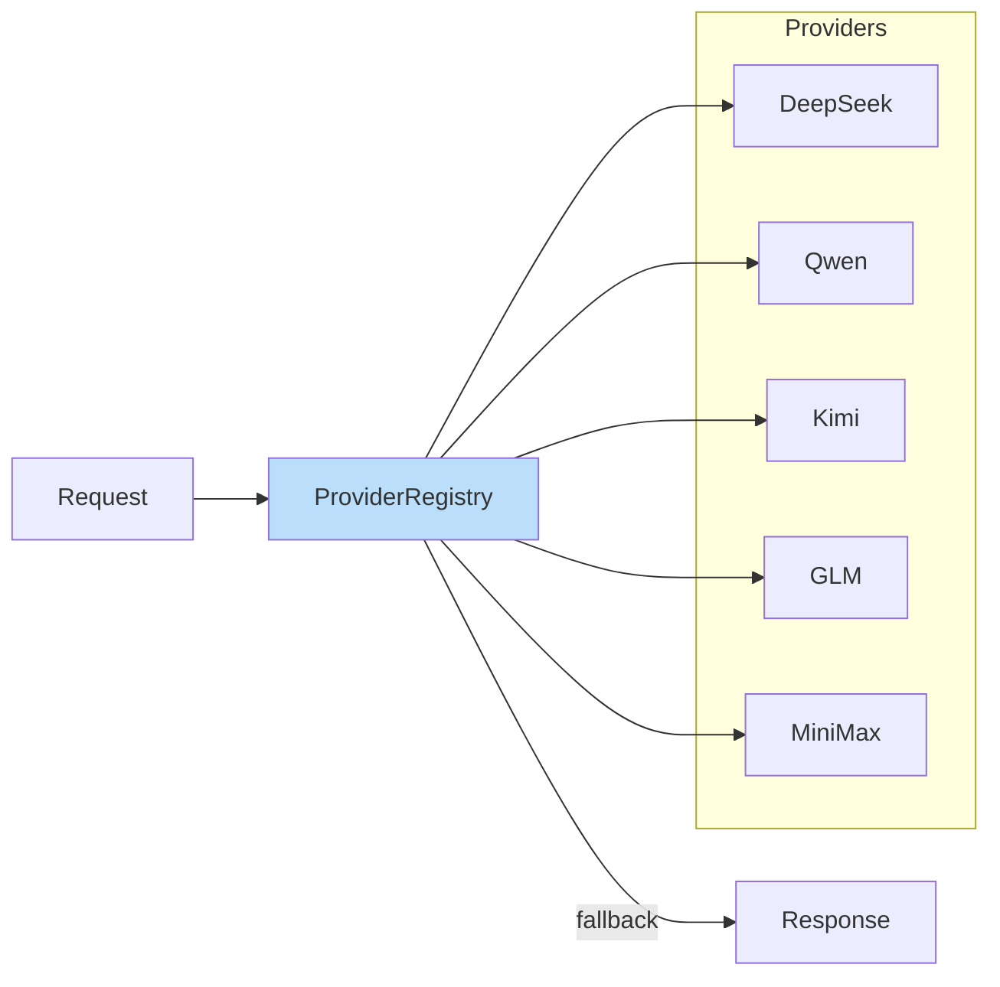

# DeepClaw Architecture Diagrams

Visual representation of DeepClaw v3.5.0 architecture using Mermaid diagrams.

## Pipeline Flow

The research pipeline follows a 5-stage flow:

### Stage Descriptions

| Stage | Purpose | Output |
|-------|---------|--------|
| PLAN | Decompose query into sub-queries | Research plan |
| SEARCH | Execute searches on multiple engines | Raw results |
| SYNTHESIZE | Combine and analyze findings | Synthesized content |
| WRITE | Generate structured report | Markdown/HTML/PDF |
| VERIFY | Quality check and validation | Verification result |

## Gate System

The Gate system enforces quality checkpoints:

## Monitoring Flow

Observer collects metrics throughout the pipeline:

### Metrics

| Metric | Type | Description |
|--------|------|-------------|
| `researchDurationMs` | Counter | Total pipeline time |
| `phaseDurationMs` | Gauge | Time per phase |
| `agentResponseTimeMs` | Gauge | Per-agent timing |
| `cacheHitRate` | Gauge | Cache efficiency |
| `errorRate` | Gauge | Failure ratio |
| `sourceCount` | Counter | Sources found |
| `tokenUsage` | Counter | Tokens consumed |

### Alert Rules

| Rule | Threshold | Severity |
|------|:---------:|:--------:|
| high_error_rate | > 30% | warning |
| slow_response | > 120s | warning |
| low_cache_hit | < 20% | info |
| token_budget_exceeded | > 100k | critical |
| zero_sources | = 0 | critical |

## Approval Flow

Human-in-the-Loop approval state machine:

### Approval Points

| Point | When | Timeout Behavior |
|-------|------|------------------|
| research_plan | Before pipeline execution | Auto-approve |
| budget_threshold | Token estimate > budget | Auto-reject |
| source_quality | Low-quality sources | Auto-reject |

## Module Dependencies

## Multi-Agent Architecture

## LLM Provider Registry

### Provider Capabilities

| Provider | Chat | Streaming | Embeddings | Function Calling |
|----------|:----:|:---------:|:----------:|:----------------:|
| DeepSeek | ✅ | ✅ | ✅ | ✅ |
| Qwen | ✅ | ✅ | ✅ | ✅ |
| Kimi | ✅ | ✅ | ❌ | ❌ |
| GLM | ✅ | ✅ | ✅ | ❌ |
| MiniMax | ✅ | ✅ | ✅ | ❌ |

---

*DeepClaw v3.5.0 Architecture Diagrams*
