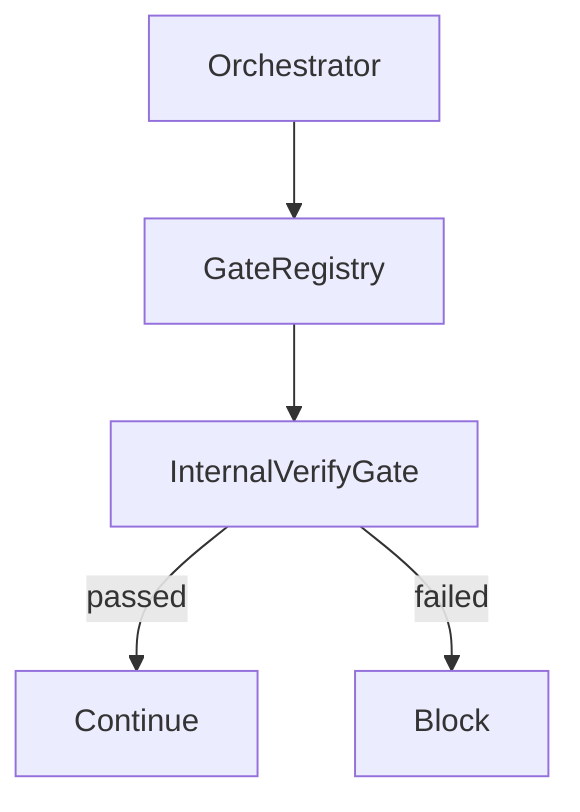
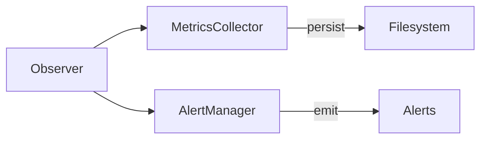
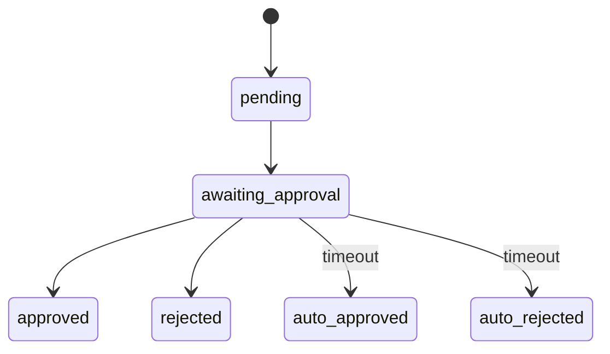
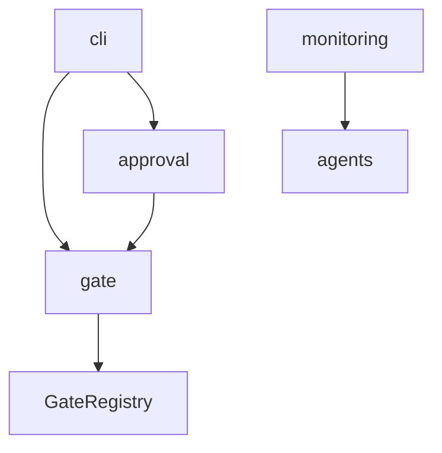

# DeepClaw v3.5.0 Phase 3 — Detailed Design

**Version**: 1.0
**Stage**: DESIGN — Detailed Design
**Date**: 2026-07-17
**Author**: Jarvis (B)
**Based On**: Phase 3 Summary Design (`docs/design/v3.5.0-phase3-summary.md`)

---

## 1. Trigger Manager

### 1.1 Overview

The Trigger Manager provides lightweight automation for DeepClaw research pipelines. Unlike DevClaw's full automation, DeepClaw's trigger system is minimal — designed for scheduled runs and failure retries only.

**Key Design Principle**: Lightweight, file-based, zero external dependencies.

### 1.2 File Breakdown

#### `src/trigger/types.ts`

**Purpose**: Type definitions for triggers.

```typescript
// ── Trigger Types ────────────────────────────────────────────────────

/** Trigger type */
export type TriggerType = "schedule" | "event" | "manual";

/** Trigger status */
export type TriggerStatus = "active" | "paused" | "disabled";

/** Trigger definition */
export interface Trigger {
  id: string;
  name: string;
  type: TriggerType;
  status: TriggerStatus;
  createdAt: string;
  lastRunAt?: string;
  nextRunAt?: string;
  runCount: number;
  config: ScheduleConfig | EventConfig | ManualConfig;
}

/** Schedule trigger config (cron-based) */
export interface ScheduleConfig {
  cron: string;              // Cron expression (e.g., "0 9 * * *" = 9am daily)
  topic: string;             // Research topic
  sources?: string[];        // Search sources
  maxRetries?: number;       // Retry on failure
}

/** Event trigger config */
export interface EventConfig {
  event: "on_failure" | "on_success" | "on_timeout";
  topic: string;
  sources?: string[];
  cooldown?: number;         // Cooldown period in seconds
}

/** Manual trigger config */
export interface ManualConfig {
  topic: string;
  sources?: string[];
}

/** Trigger execution result */
export interface TriggerResult {
  triggerId: string;
  executedAt: string;
  success: boolean;
  pipelineId?: string;
  error?: string;
}

/** Trigger manager config */
export interface TriggerManagerConfig {
  triggerDir?: string;
  maxConcurrent?: number;
  defaultRetries?: number;
}
```

---

#### `src/trigger/TriggerManager.ts`

**Purpose**: Trigger registration, scheduling, and execution.

**Class Design**:

```typescript
import type {
  Trigger,
  TriggerType,
  TriggerStatus,
  TriggerResult,
  TriggerManagerConfig,
  ScheduleConfig,
  EventConfig,
} from "./types.js";
import * as fs from "fs";
import * as path from "path";
import * as os from "os";
import * as crypto from "crypto";

const DEFAULT_TRIGGER_DIR = path.join(os.homedir(), ".deepclaw", "triggers");

/**
 * Lightweight trigger manager for DeepClaw.
 *
 * Design Decision: File-based (no external scheduler) because:
 * - DeepClaw is primarily interactive, not automated
 * - Cron-style scheduling is sufficient
 * - No external dependencies (Redis, Temporal, etc.)
 */
export class TriggerManager {
  private config: Required<TriggerManagerConfig>;
  private triggers: Map<string, Trigger> = new Map();
  private triggerDir: string;
  private schedulerInterval?: NodeJS.Timeout;

  constructor(config?: Partial<TriggerManagerConfig>);

  // ── Registration ────────────────────────────────────────────────────

  /**
   * Register a new trigger.
   */
  register(
    name: string,
    type: TriggerType,
    config: ScheduleConfig | EventConfig | ManualConfig
  ): Trigger;

  /**
   * Unregister a trigger.
   */
  unregister(triggerId: string): boolean;

  /**
   * Get trigger by ID.
   */
  get(triggerId: string): Trigger | undefined;

  /**
   * Get trigger by name.
   */
  getByName(name: string): Trigger | undefined;

  /**
   * List all triggers.
   */
  listAll(): Trigger[];

  /**
   * List triggers by type.
   */
  listByType(type: TriggerType): Trigger[];

  // ── Status Management ────────────────────────────────────────────────

  /**
   * Pause trigger.
   */
  pause(triggerId: string): boolean;

  /**
   * Resume trigger.
   */
  resume(triggerId: string): boolean;

  /**
   * Disable trigger.
   */
  disable(triggerId: string): boolean;

  // ── Execution ─────────────────────────────────────────────────────────

  /**
   * Execute a trigger manually.
   */
  execute(triggerId: string): Promise<TriggerResult>;

  /**
   * Execute trigger by name (for CLI).
   */
  executeByName(name: string): Promise<TriggerResult>;

  /**
   * Process due triggers (called by scheduler).
   */
  processDue(): Promise<TriggerResult[]>;

  // ── Scheduler ─────────────────────────────────────────────────────────

  /**
   * Start the scheduler (checks for due triggers periodically).
   */
  startScheduler(intervalMs?: number): void;

  /**
   * Stop the scheduler.
   */
  stopScheduler(): void;

  // ── Persistence ───────────────────────────────────────────────────────

  /**
   * Persist triggers to disk.
   */
  persist(): void;

  /**
   * Load triggers from disk.
   */
  load(): void;
}
```

**Cron Parsing** (simplified):

```typescript
// Simple cron parser (minute hour day-of-month month day-of-week)
// Only supports: *, */n, and specific values
function parseCron(cron: string): { next: (from: Date) => Date } {
  const parts = cron.split(" ");
  // ... simplified implementation
}

// Example:
// "0 9 * * *" → runs at 9:00 AM daily
// "*/30 * * * *" → runs every 30 minutes
```

**Integration with PipelineCoordinator**:

```typescript
// TriggerManager creates pipelines via PipelineCoordinator
async execute(triggerId: string): Promise<TriggerResult> {
  const trigger = this.triggers.get(triggerId);
  if (!trigger) throw new Error("Trigger not found");

  const coordinator = new PipelineCoordinator();
  const pipeline = coordinator.create(trigger.config.topic);

  await coordinator.start(pipeline.id);
  // ... execution

  return {
    triggerId,
    executedAt: new Date().toISOString(),
    success: true,
    pipelineId: pipeline.id,
  };
}
```

---

### 1.3 Design Decisions

#### Why File-Based (No External Scheduler)

| Approach | Pros | Cons |
|----------|------|------|
| **File-based (selected)** | Zero deps, portable, debuggable | No distributed scheduling |
| Redis-based | Distributed, reliable | External dependency |
| Temporal/Temporal.io | Enterprise-grade | Overkill for DeepClaw |

**Decision**: File-based because:
- DeepClaw is interactive-first, automation is secondary
- Expected <10 triggers per deployment
- No distributed execution needed

#### Why Lightweight (~150 lines)

| Feature | Included | Excluded |
|---------|:--------:|:--------:|
| Cron scheduling | ✅ | — |
| Event triggers | ✅ | — |
| Manual triggers | ✅ | — |
| Persistence | ✅ | — |
| Distributed locks | — | ❌ |
| Retry with backoff | — | ❌ |
| Webhook notifications | — | ❌ |

**Decision**: Keep minimal because:
- Complex features add maintenance burden
- Most users don't need enterprise automation
- Can be extended in v3.6.0 if needed

---

### 1.4 Error Handling

| Error Type | Handling |
|------------|----------|
| Invalid cron expression | Throw on registration |
| Trigger not found | Return undefined/throw |
| Execution failure | Return TriggerResult with success=false |
| Persistence failure | Log, continue (in-memory state preserved) |

---

## 2. Provider Registry Enhancement

### 2.1 Overview

DeepClaw already has `LLMProviderRegistry` in `src/llm/base.ts`. Phase 3 adds:
1. **Capability-based routing** — select provider by feature
2. **Fallback chains** — auto-failover on provider failure
3. **Provider health tracking** — track success/failure rates

### 2.2 New Types

**Add to `src/llm/types.ts`**:

```typescript
// ── Provider Capabilities ─────────────────────────────────────────────

/** Provider capabilities/features */
export type ProviderCapability = 
  | "chat"
  | "streaming"
  | "embeddings"
  | "function_calling"
  | "vision";

/** Provider metadata */
export interface ProviderMetadata {
  name: string;
  capabilities: ProviderCapability[];
  defaultModel: string;
  maxTokens: number;
  pricing?: {
    input: number;   // per 1K tokens
    output: number;  // per 1K tokens
  };
}

/** Provider health status */
export interface ProviderHealth {
  name: string;
  status: "healthy" | "degraded" | "unhealthy";
  successRate: number;     // 0-1
  avgLatency: number;      // ms
  lastError?: string;
  lastCheck: string;
}

/** Routing config */
export interface RoutingConfig {
  preferredProvider?: string;
  fallbackChain?: string[];
  requireCapability?: ProviderCapability;
  maxLatency?: number;
}

/** Fallback config */
export interface FallbackConfig {
  enabled: boolean;
  maxRetries: number;
  retryDelay: number;      // ms
  providers: string[];     // fallback order
}
```

### 2.3 Enhanced ProviderRegistry

**Update `src/llm/base.ts`** (extend existing class):

```typescript
/**
 * Enhanced provider registry with capabilities and fallback.
 */
export class LLMProviderRegistry {
  private static providers: Map<string, LLMProviderClass> = new Map();
  private static metadata: Map<string, ProviderMetadata> = new Map();
  private static health: Map<string, ProviderHealth> = new Map();

  // ── Registration ─────────────────────────────────────────────────────

  /**
   * Register provider with metadata.
   */
  static register(
    name: string,
    providerClass: LLMProviderClass,
    metadata?: Partial<ProviderMetadata>
  ): void;

  /**
   * Register provider with decorator.
   */
  static registerWithMetadata(
    name: string,
    metadata: ProviderMetadata
  ): ClassDecorator;

  // ── Lookup ────────────────────────────────────────────────────────────

  /**
   * Get provider by name.
   */
  static get(name: string): LLMProviderClass | undefined;

  /**
   * Get provider by capability.
   */
  static getByCapability(capability: ProviderCapability): LLMProviderClass[];

  /**
   * Get best provider for request.
   */
  static getBestProvider(config: RoutingConfig): LLMProviderClass | undefined;

  // ── Health Tracking ───────────────────────────────────────────────────

  /**
   * Report provider success.
   */
  static reportSuccess(name: string, latency: number): void;

  /**
   * Report provider failure.
   */
  static reportFailure(name: string, error: string): void;

  /**
   * Get provider health.
   */
  static getHealth(name: string): ProviderHealth | undefined;

  /**
   * Get all health statuses.
   */
  static getAllHealth(): ProviderHealth[];

  // ── Fallback Execution ────────────────────────────────────────────────

  /**
   * Execute with fallback chain.
   */
  static async executeWithFallback(
    request: ChatCompletionRequest,
    config: FallbackConfig
  ): Promise<ChatCompletion>;

  // ── Metadata ──────────────────────────────────────────────────────────

  /**
   * Get provider metadata.
   */
  static getMetadata(name: string): ProviderMetadata | undefined;

  /**
   * List all providers with metadata.
   */
  static listProviders(): string[];

  /**
   * List providers by capability.
   */
  static listByCapability(capability: ProviderCapability): string[];
}
```

### 2.4 Fallback Implementation

```typescript
/**
 * Execute with automatic fallback on failure.
 */
static async executeWithFallback(
  request: ChatCompletionRequest,
  config: FallbackConfig
): Promise<ChatCompletion> {
  const providers = config.providers ?? this.listProviders();
  let lastError: Error | undefined;

  for (const name of providers) {
    const providerClass = this.get(name);
    if (!providerClass) continue;

    const provider = new providerClass({});

    try {
      const result = await provider.chat(request);
      this.reportSuccess(name, 0); // TODO: track actual latency
      return result;
    } catch (err) {
      lastError = err as Error;
      this.reportFailure(name, lastError.message);

      if (!config.enabled) {
        throw lastError;
      }

      // Wait before trying next provider
      if (config.retryDelay > 0) {
        await new Promise(r => setTimeout(r, config.retryDelay));
      }
    }
  }

  throw new Error(`All providers failed. Last error: ${lastError?.message}`);
}
```

### 2.5 Existing Provider Wrapping

**No changes required to existing providers**. They already implement `LLMProvider` interface.

**Registration update** (in `src/llm/index.ts`):

```typescript
// Register existing providers with metadata
import { DeepSeekProvider } from "./providers/deepseek.js";
import { QwenProvider } from "./providers/qwen.js";
import { KimiProvider } from "./providers/kimi.js";
import { GLMProvider } from "./providers/glm.js";
import { MiniMaxProvider } from "./providers/minimax.js";

LLMProviderRegistry.register("deepseek", DeepSeekProvider, {
  capabilities: ["chat", "streaming", "embeddings"],
  defaultModel: "deepseek-chat",
  maxTokens: 32000,
});

LLMProviderRegistry.register("qwen", QwenProvider, {
  capabilities: ["chat", "streaming", "embeddings"],
  defaultModel: "qwen-turbo",
  maxTokens: 8192,
});

// ... other providers
```

---

### 2.6 Design Decisions

#### Why Registry Pattern (Not Factory)

| Pattern | Pros | Cons |
|---------|------|------|
| **Registry (selected)** | Dynamic registration, runtime lookup | Slightly more complex |
| Factory | Simple creation | Static, no runtime changes |

**Decision**: Registry because:
- Already implemented in `base.ts`
- Supports dynamic provider registration
- Enables capability-based lookup

#### How Fallback Works

```
Request → Provider 1 (DeepSeek)
           ↓ (fail)
         Provider 2 (Qwen)
           ↓ (fail)
         Provider 3 (Kimi)
           ↓ (success)
         Response
```

**Configuration**:

```typescript
const config: FallbackConfig = {
  enabled: true,
  maxRetries: 3,
  retryDelay: 1000,
  providers: ["deepseek", "qwen", "kimi"],
};

const result = await LLMProviderRegistry.executeWithFallback(request, config);
```

---

## 3. Documentation

### 3.1 CONTRIBUTING.md

**Structure**:

```markdown
# Contributing to DeepClaw

## Development Setup

### Prerequisites
- Node.js 18+
- npm or yarn

### Getting Started
```bash
git clone https://github.com/peterchengorg/deepclaw.git
cd deepclaw
npm install
npm run build
npm test
```

## Project Structure

## Code Style

### TypeScript
- Strict mode enabled
- No `any` types (use `unknown`)
- Zod for runtime validation

### Commits
- Conventional Commits
- `feat:`, `fix:`, `docs:`, `test:`

## Pull Request Process

1. Fork → Branch → PR
2. All tests must pass
3. No Chinese characters in source
4. Apache 2.0 license header

## Testing
- Unit tests with vitest
- 80%+ coverage target

## License
Apache 2.0
```

---

### 3.2 docs/MIGRATION.md

**Structure**:

```markdown
# Migration Guide: v3.4.0 → v3.5.0

## Overview

v3.5.0 introduces Gate enforcement, Pipeline CLI, Monitoring, and HitL Approval.

## Breaking Changes

### None
v3.5.0 is backward compatible with v3.4.0.

## New Features

### Gate System
```typescript
// New: Gate enforcement
import { GateRegistry, InternalVerifyGate } from "deepclaw/gate";

const registry = new GateRegistry();
const gate = new InternalVerifyGate(registry);
```

### Pipeline CLI
```bash
# New: CLI commands
deepclaw pipeline create "AI Safety"
deepclaw pipeline status
```

### Monitoring
```typescript
// New: Observer hooks
import { DeepClawObserver } from "deepclaw/monitoring";

const observer = new DeepClawObserver();
observer.onResearchStart(pipelineId, topic);
```

### Approval Flow
```typescript
// New: Human-in-the-Loop
import { ApprovalFlow, ApprovalGate } from "deepclaw/approval";
```

## Deprecated APIs

### None

## Configuration Changes

### New directories
- `~/.deepclaw/gates/` — Gate state persistence
- `~/.deepclaw/pipelines/` — Pipeline state
- `~/.deepclaw/metrics/` — Metrics history
- `~/.deepclaw/approval/` — Approval requests

## Migration Steps

1. Update package: `npm install deepclaw@3.5.0`
2. No code changes required
3. New features are opt-in
```

---

### 3.3 docs/architecture/diagrams.md

**Structure**:

```markdown
# DeepClaw Architecture Diagrams

## Pipeline Flow


## Gate System



## Monitoring Flow



## Approval Flow



## Module Dependencies


```

---

### 3.4 README.md Update

**New sections**:

```markdown
# DeepClaw

## v3.5.0 Features

### 🚪 Gate Enforcement
Enforce quality checkpoints in research pipelines.

### 📊 Monitoring Observer
Track research metrics with 7 metrics and 5 alert rules.

### 👤 Human-in-the-Loop
Approval flow for critical decisions.

### 🔧 Pipeline CLI
Command-line control for research workflows.

## Quick Start

```bash
# Install
npm install deepclaw

# CLI
deepclaw pipeline create "Your research topic"
deepclaw pipeline status

# Programmatic
import { Orchestrator, DeepClawObserver } from "deepclaw";
```

## Badges

[](https://badge.fury.io/js/deepclaw)
[](https://opensource.org/licenses/Apache-2.0)
[](https://www.typescriptlang.org/)
```

---

## 4. Test Case Outline

### 4.1 TriggerManager Tests (8+)

| # | Test Scenario | Expected Behavior |
|:-:|---------------|-------------------|
| 1 | Register schedule trigger | Trigger saved with cron config |
| 2 | Register event trigger | Trigger saved with event config |
| 3 | Unregister trigger | Trigger removed from registry |
| 4 | Pause/Resume trigger | Status toggles correctly |
| 5 | Execute manual trigger | Pipeline created, result returned |
| 6 | Process due triggers | Only due triggers executed |
| 7 | Persist/load triggers | Triggers persist across restarts |
| 8 | Invalid cron expression | Error on registration |

### 4.2 ProviderRegistry Tests (6+)

| # | Test Scenario | Expected Behavior |
|:-:|---------------|-------------------|
| 1 | Register with metadata | Metadata stored correctly |
| 2 | Get by capability | Returns providers with capability |
| 3 | Report success/failure | Health status updated |
| 4 | Fallback on failure | Next provider tried |
| 5 | All providers fail | Error with details |
| 6 | Get best provider | Returns healthiest provider |

---

## 5. Implementation Size Estimate

| Module | Source Lines | Test Lines |
|--------|-------------:|-----------:|
| TriggerManager | ~150 | ~120 |
| ProviderRegistry enhancement | ~80 | ~100 |
| **Total** | **~230** | **~220** |

**Documentation**: ~500 lines across 4 files

---

## 6. Alternative Approaches

### 6.1 External Scheduler (node-cron)

**Idea**: Use `node-cron` package for scheduling.

**Rejected because**:
- Adds dependency
- Simple cron parsing is sufficient
- File-based persistence is cleaner

### 6.2 Circuit Breaker for Providers

**Idea**: Implement circuit breaker pattern for provider health.

**Rejected because**:
- Over-engineering for current scale
- Simple success/failure tracking is sufficient
- Can be added in v3.6.0 if needed

---

## 7. References

- Phase 3 Summary Design: `docs/design/v3.5.0-phase3-summary.md`
- Existing LLM Provider Registry: `src/llm/base.ts`
- DevClaw Trigger Manager: `../devclaw/src/rsi/trigger/` (inspiration)

---

*Document created by Jarvis (B) — 2026-07-17*
*DeepClaw v3.5.0 Phase 3 Detailed Design*
